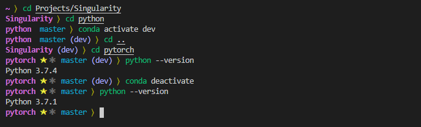

# Humbled
A clean and humble zsh theme with support for condaenv, virtualenv and git with everything left aligned with the working directory in bold


## Plugin Dependencies

1. git
1. virtualenv
1. [condaenv](https://github.com/saravanabalagi/zsh-plugin-condaenv)

## Installation

1. Update `plugins` in `~/.zshrc`

	```
	plugins=(
		...
		git
		virtualenv
		condaenv
	)  
	```

	Note that for [condaenv](https://github.com/saravanabalagi/zsh-plugin-condaenv), you also need to download it.

	```
	git clone https://github.com/saravanabalagi/zsh-plugin-condaenv $ZSH_CUSTOM/plugins/condaenv
	```


1. Download humbled

	```
	git clone https://github.com/saravanabalagi/zsh-theme-humbled $ZSH_CUSTOM/themes/humbled
	```

1. Update `ZSH_THEME` in `~/.zshrc` file

	```
	ZSH_THEME="humbled/humbled"
	```

Enjoy humbled! Also check out [modesty](https://github.com/saravanabalagi/zsh-theme-modesty) for separate left and right aligned prompt theme.



## Licence

Please refer to the [License](LICENSE) file.
